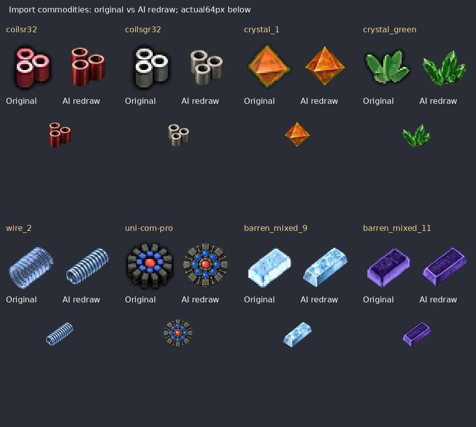

# AI artwork batch 2: import commodities

This continues the [accepted AI-redraw method](decisions/ai-artwork.md) after the owner confirmed the generated-arrow candidate works and requested continuation. Version remains **0.5.1**; PR #6 remains unmerged, with no migrations.

Eight original 32px base icons now use 64px AI redraws: red coils, grey coils, orange crystal, green crystal, wire coil, universal processor, and blue/purple alloy bars. Only the eight `icon_size` fields in `prototypes/ir_imports.lua` change in Lua. The existing Yuoki helper automatically supplies updated base layers to their eight import and eight export icons; no baked-arrow files or helper changes are introduced.

The [cumulative manifest](data/ai-redraw-0.5.1.json) retains each original hash, final icon hash, full-resolution source path/dimensions/hash, prompt and batch identity. Sources and the comparison are saved under `docs/artwork/ai-redraw-0.5.1/`. Runtime derivatives use the same RGBA Lanczos reduction to 64×64 as the first batch. The [arrow manifest](data/trade-icons-0.5.1.json) updates only these eight retained base images' current hashes/dimensions; its removed-variant identities stay unchanged.

## Color correction and review requirement

The owner identified a color mismatch in the first processor output. Inspection of the enlarged original established **one red center surrounded by eight blue cells**, with muted olive-grey metal. The first output incorrectly had an orange center and two green outer cells; it was rejected before installation. The corrected image restores the original color placement. Both the original generation prompt and the explicit correction prompt are retained in the manifest so this decision is reproducible; the rejected output is not shipped.

For subsequent AI work, inspect an enlarged original **before describing its colors**. Specify color-bearing parts and their positions explicitly when they distinguish the item. Compare the result at intended icon size as well as full resolution; reject changed color assignments. AI texture/detail may vary, but original color coding and recognizable identity must be preserved.

All eight originals were inspected enlarged, and the selected 64px outputs were compared visually. All sources have real transparency and the visible artwork fits inside the canvas. Some generated sources have isolated alpha 1/255 background residue; the frame-bound check excludes that quantization-level residue and verifies that no visible object pixels reach the border. Source PNGs are preserved without alpha modification.

## Validation and remaining work

The package still has 118 local PNGs: **12 AI redraws and 106 unchanged originals**. No unused unique asset, disabled declaration, parent-asset replacement or recipe quantity is changed. All 105 recipe routes and 35 disabled recipe states remain preserved. World sprites and animations are unchanged.

[Validation evidence](data/ai-artwork-batch-2-validation.txt) records package loading, fresh-game creation, same-version save reload, provider/original hashes and complete prototype-dump comparison. Expected differences from the previous candidate are exactly eight item icon sizes and sixteen recipe base-layer sizes/scales. The corrected processor was reviewed against the original; the integrated batch still needs the owner's graphical-client check. Further retained artwork remains future batches under the same color-preservation and generated-arrow rules.
