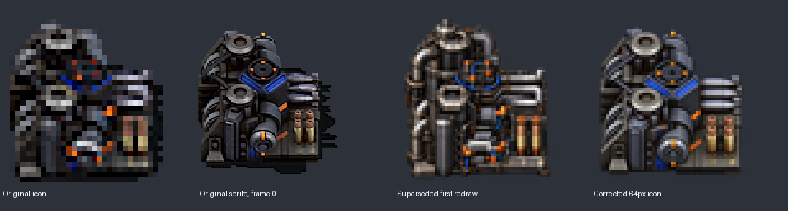

# Ammunition factory: sprite-referenced correction

The owner accepted the latest building-icon appearance, then requested redoing the ammunition factory from the first AI round because its structure no longer matched the more accurate set. Version remains **0.5.1**, with no migrations or merge.

The original `fab-ammo-sheet.png` contains sixteen 128×128 frames in one row. All frames were inspected. Frame 0 shows two grey-rimmed circular stations along the ground, a blue-trimmed center assembly with orange markers, a front rotor under a curved housing, three horizontal silver projectiles and four upright brass/copper cases on the right platform. The first AI prompt instead described a tall processing tower, causing the structural mismatch.

The corrected 64px icon uses the original frame and original 32px icon as geometry/color references. The accepted equipment-factory master supplies rendering style only. The blue trim, orange marks, station layout and ammunition remain specific to this factory. Both pinned parents were checked against the recent 242-path building-art review and a refreshed ammunition/factory filename search; no equivalent replacement was found in the reviewed assets. The parent commits are recorded in the [batch3 reference audit](data/artwork-batch-3-references.json).

The built-in `image_gen` tool produced the corrected transparent master at [fabrik-ammo-icon-source.png](artwork/ai-redraw-0.5.1/fabrik-ammo-icon-source.png). Its runtime derivative uses the established RGBA Lanczos reduction to 64×64. The [AI manifest](data/ai-redraw-0.5.1.json) records the exact correction prompt, sprite/style reference hashes, current output hashes and the superseded first-round prompt/source identity. The earlier master remains available at recorded commit `dedaf639cd7b5562972cab6efeaec96567dbd41d`; the historical first-round comparison is unchanged.

Only this runtime PNG and the changelog change outside documentation. Its item/entity already declare 64px icons, so no Lua or prototype metadata changes are needed. The other 18 AI icons, 98 original PNGs, world animation, all recipes and quantities remain unchanged. Full-resolution and 64px comparisons were inspected, including transparency and visible-object margins.

[Validation](data/ammunition-factory-artwork-validation.txt) records package loading, complete prototype equality with the previous candidate, original/current asset checks and ZIP/source equality. The recent fresh-game and 600-tick reload evidence remains applicable because runtime logic and every prototype are unchanged. The corrected icon still needs the owner's graphical-client check.
