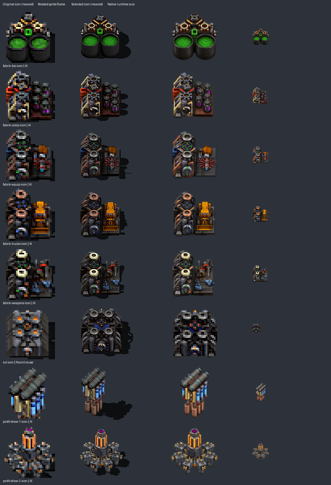

# Artwork batch 3: factories and display buildings

The owner confirmed the import-icon candidate works and requested continuation. This batch stays at **0.5.1** in draft PR #6, with no migrations. Seven building icons receive sprite-referenced AI redraws at 64px. The shared factory icon instead uses existing Engines artwork directly.

## Reference correction and standing decision

The first drafts relied on enlarged 32px icons. The owner rejected the component-factory and shared-factory interpretations and directed us to check the corresponding animation sheets **and both parent mods**. The component draft incorrectly stacked ground-level stations into a tall tower and enlarged manufactured canisters into factory structures. The shared-factory draft invented four orange lights where the sprite shows circular stations. All eight icon-only drafts were rejected before installation.

For future artwork, first trace the icon to its entity, inspect the actual sprite/animation frames using their declared frame dimensions, and check Yuoki Industries and Yuoki Engines for related artwork. Prefer direct parent references for confirmed duplicates. Otherwise provide both the original icon and the corresponding sprite frame to the redraw tool; preserve the camera, footprint, machine structure and color assignments. Review the result at full resolution and its intended game size. Do not infer the machine's geometry from a tiny icon alone.

The populated component-factory animation clarifies that its right-hand brown platform fills with six small purple-windowed canisters; frame 12 is used here. The bio factory uses its green-filled state at frame 6. Frame indices are zero-based. Static display sprites clarify that the first display has two cylindrical pipes, and the second has a purple top and six radial assemblies.

| Icon | Structural reference | Result |
|---|---|---|
| Bio factory | `fab-bio-sheet.png`, 128×128, frame 6 | Green-filled paired vats; 64px redraw |
| Component factory | `fab-comp-sheet.png`, 128×128, frame 12 | Ground-level production stations and six canisters; 64px redraw |
| Equipment factory | `fab-equip-sheet.png`, 128×128, frame 0 | Green station indicators and red-spoked assembly; 64px redraw |
| Vehicle factory | `fab-trucks-sheet.png`, 128×128, frame 0 | Copper-rimmed stations and orange vehicle assembly; 64px redraw |
| Weapons factory | `fab-weapons-sheet.png`, 128×128, frame 0 | Cream-rimmed stations and red/blue workpieces; 64px redraw |
| Shared factory | PFW `tut-vai1.png` / `tut-hai1.png`; Engines `science_gen.png` | Direct Engines `science_gen_icon.png` reference at its existing 32px size |
| Profit display 1 | `profit-show-1.png`, 160×160 | Twin grey-green pipes, brass supports and blue cylinders; 64px redraw |
| Profit display 2 | `profit-show-2.png`, 160×160 | Orange center with purple top and six grey radial assemblies; 64px redraw |

## Parent comparison and reuse

Both pinned 1.3.0 parents were checked: 242 distinct loaded building-graphic paths were visually inspected using prototype frame dimensions, alongside filename candidates such as Engines' unused `tut-2.png`. Engines' `science_gen.png` shows the same four-station, blue-center and front-rotor machinery family as the shared PFW factory. Its icon is a different rendering/state, not a byte-identical copy. Six PFW item/entity icon references now point directly to that parent icon; the redundant local `tut-icon.png` is removed. The generated shared-factory draft is not installed.

This visual relationship does **not** establish equivalent machine behavior: PFW factories 4, 6 and 7 retain their own crafting categories and recipes. Their directional world sheets remain intact; replacing those requires a separate frame, direction and alignment assessment. Yuoki's composer/base-factory and Engines' assembly variants are distinct designs. No matching replacement was identified for the other seven icons in the reviewed parent assets.

[Reference and rejection records](data/artwork-batch-3-references.json) identify sheets, frame coordinates, hashes, relevant parent candidates and rejected outputs. The [AI manifest](data/ai-redraw-0.5.1.json) records original/final hashes, both initial and corrective prompts, and full-resolution sources. The [parent mapping](data/asset-reuse-0.5.1.json) records the new shared-factory icon reference. Generated masters remain under `docs/artwork/ai-redraw-0.5.1/`; their RGBA Lanczos derivatives are the runtime icons. Documentation/authoring images are excluded from the mod ZIP.

## Validation and remaining work

There are now **117 local PNGs: 19 AI icons and 98 unchanged originals**, with 40 parent-artwork replacements and 49 removed arrow variants. All world sprites, unused unique artwork, disabled source, recipes and quantities remain unchanged in this batch. Production Lua changes are limited to 14 icon-size values and six parent-icon paths; the trade-arrow helper remains unchanged.

[Validation evidence](data/artwork-batch-3-validation.txt) records full prototype/preservation checks, package loading, fresh-game creation and a 600-tick same-version save reload. This batch still needs the owner's graphical-client check. The earlier import-icon candidate was accepted by the owner before this batch began.
