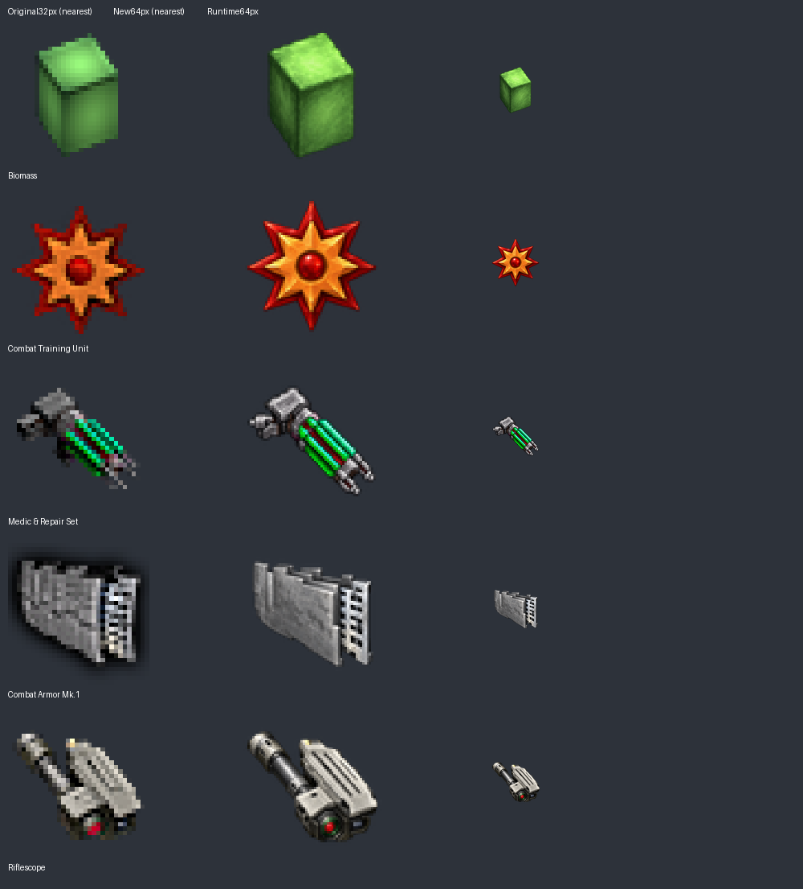

# Artwork batch 4: retained component icons

After the owner accepted the previous artwork and merged PR #6, this batch continues at **0.5.1**, without a version bump or migrations. Five active component icons receive transparent 64×64 AI redraws. No item ownership decisions or gameplay changes are included.

## Reference review

The original 32px icons, English descriptions and source consumers were inspected before generation. These five items have no assigned entity, equipment or animation sheet. Both pinned parents were searched for matching artwork and related component families; no confirmed equivalent replacement was selected. Similar-looking images alone do not establish duplicate ownership.

| Component | Original/reference identity retained | Consumers |
|---|---|---|
| Biomass | Upright green block with a bright green top. Engines' biomass/DNA images have different structures. | `y-biomass`, `y-zproduct-1-recipe` |
| Combat Training Unit | Eight-point orange/red symbol and round red center, representing programmed combat actions. | `y-combat-train`, `y-zproduct-5-recipe` |
| Medic & Repair Set | Diagonal green/cyan tool, grey head and paired end connectors. Yuoki repair-tool artwork differs. | `y-medic`, `y-zproduct-6-recipe` |
| Combat Armor Mk.1 | Layered neutral-grey plates and pale rear lattice. Yuoki's `graphics/armor/panz5_32.png` clarifies the related plate geometry; its colored tier is already mapped separately and does not replace this item. | `y-combat-armor-1`; preserved disabled `y-zproduct-2-recipe` |
| Riflescope | Asymmetric dark tube and pale ribbed housing, diagonal orientation and small green/red lens. | `y-zielfern`, `y-zproduct-7-recipe` |

Parents: Yuoki 1.3.0 at `50ea38b9703a13e8644c3bcfe6e400b3bf2b4a5c`; Engines 1.3.0 at `8d777d015e36d93d2757a290c3f3f32a49c11280`. Enlarged originals were supplied to the built-in image generator, with the related parent plate image additionally supplied for Mk.1 geometry. Original colors remain authoritative.

## Implementation and provenance

The [AI manifest](data/ai-redraw-0.5.1.json) records all five exact prompts, original/output hashes, master dimensions and reference notes. Full-resolution masters are retained under `docs/artwork/ai-redraw-0.5.1/`. Runtime images are 64px Lanczos derivatives, reviewed against the originals at actual size and enlarged. The original images remain recoverable from the immutable import.

Nine active `icon_size` fields change from 32 to 64 in `prototypes/ir_zmaterial.lua`; the commented armor recipe also receives matching metadata and stays disabled. No other production Lua changes occur. All previous redraws, animation sheets, unused unique artwork, parent references and generated-arrow behavior remain unchanged. The local inventory is now **24 AI icons and 93 unchanged original PNGs**, totaling 117. The existing 40 parent replacements and 49 removed arrow variants are unchanged.

## Validation

Factorio 2.1.21 headless loaded the packaged mod with both parents, created a fresh game and reloaded it for 600 ticks. The full data/preservation validator passes. An independent comparison against the preceding candidate finds exactly the nine intended active icon-size changes, with no other prototype differences. All 105 recipe routes and quantities, 35 disabled recipe states, and 232 original archive files remain preserved. The 144-file candidate ZIP matches runtime source exactly and excludes documentation/master images.

[Validation and package identity](data/artwork-batch-4-validation.txt) record these checks. Integrated graphical appearance remains for the owner's local client check; headless validation does not establish that result.
