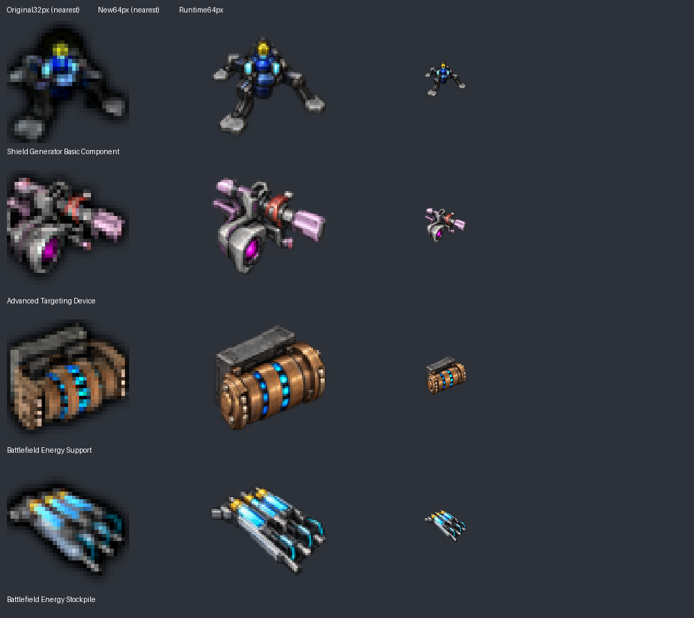

# Artwork batch 5: battlefield-support components

Version remains **0.5.1**. This continues draft PR #7 after the owner accepted the preceding component batch. Four retained 32px icons become transparent 64px AI redraws; item identities, recipes and quantities remain unchanged.

## References and correction

Before drawing, the original enlarged icons, English names, `ir_fab8.lua` and `uo_fab8.lua` were inspected. These four items have no assigned entity, equipment or animation sprite. Both pinned parents were checked by filename and visual candidates, including Yuoki's armor family and 1,102 small parent images. No confirmed matching replacement was found. Similarity ranking was only a discovery aid, not evidence for removing an asset.

| Item | Retained visual identity |
|---|---|
| `y-equ-0` Shield Generator Basic Component | Dark splayed supports, grey pads, blue/cyan central assembly and yellow upper accent. |
| `y-equ-3` Advanced Targeting Device | Asymmetric grey/purple mechanism, magenta lens and pale lilac ends. |
| `y-equ-4` Battlefield Energy Support | Charcoal box with a copper cylindrical unit attached to its side, with blue/cyan segmented insets. |
| `y-equ-5` Battlefield Energy Stockpile | Diagonal storage assembly, grey frame, cyan cells and yellow contacts. |

The owner rejected the energy-support unit's first flat-case redraw and its subsequent whole-unit upright canister. The clarification was **“more like a box with a cylinder on its side”**. The selected correction has a rectangular rear housing and a horizontal cylinder attached externally. The rejected masters and prompts are retained as discovery evidence, and neither rejected version was installed. The final corrected appearance still awaits owner confirmation.

Parents remain Yuoki 1.3.0 at `50ea38b9703a13e8644c3bcfe6e400b3bf2b4a5c` and Engines 1.3.0 at `8d777d015e36d93d2757a290c3f3f32a49c11280`. No ambiguous ownership decision changes.

## Implementation and evidence

The built-in image generator produced the full-resolution masters. [The existing manifest](data/ai-redraw-0.5.1.json) preserves prompts, original/output hashes, master paths and the correction history. Runtime images are 64px Lanczos derivatives. Full-resolution masters and the comparison are in `docs/artwork/ai-redraw-0.5.1/`.

Only four item `icon_size` values change in production Lua. Yuoki's existing helper automatically updates the base layers of three active export icons; the pink arrows stay unchanged. Four base-image records in the arrow manifest receive updated hashes/dimensions, including the preserved inactive shield-component export mapping. No recipe is enabled or removed. Previous artwork, unused unique assets, disabled source and animations remain unchanged. There are now **28 AI icons and 89 unchanged original PNGs**, totaling 117; the previous 40 parent replacements and 49 removed arrow variants are unchanged.

Factorio 2.1.21 headless loaded the 144-file package, created a fresh game and reloaded it for 600 ticks. Full data/preservation checks pass. An independent comparison against batch4 finds exactly four item icon-size changes and three export base-layer size/scale pairs, with no other prototype differences. All 105 recipes and quantities, 35 disabled recipe states and 232 original archive files remain preserved. [Validation and package identity](data/artwork-batch-5-validation.txt) record the result. Integrated graphical testing remains for the owner's local client. No version bump or migrations were added.
