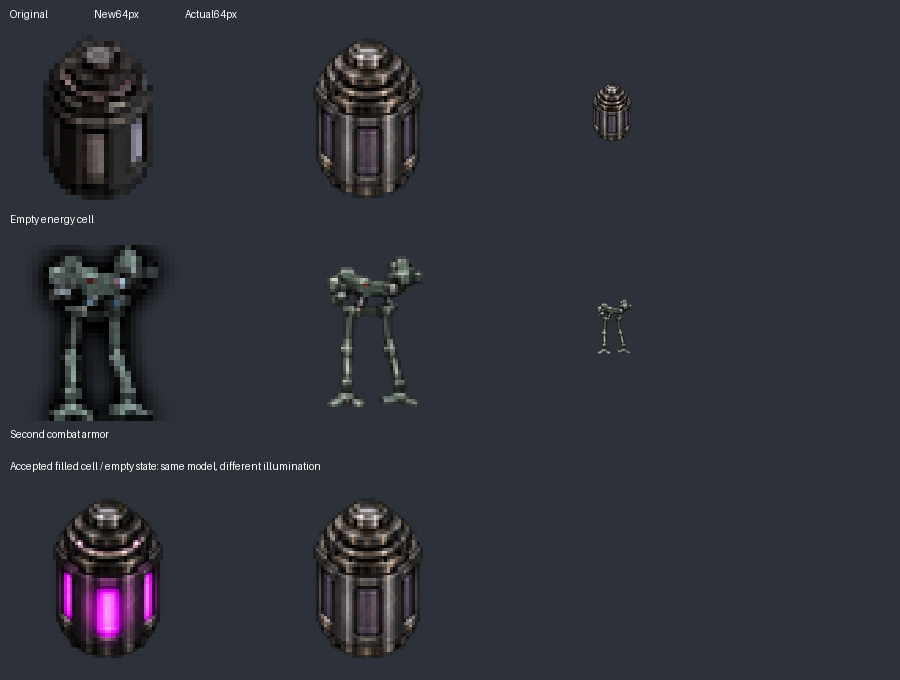

# Artwork batch 6: empty cell and second armor

Version stays **0.5.1**. This batch completes the two remaining active 32px inventory icons: the empty energy cell and second combat armor. No ownership decisions, recipes, statistics or animation sheets change.

## Reference decisions

The empty cell was compared with the original empty icon, the local `graphics/equip/fusion-cell-64.png` equipment sprite and the accepted first-round filled-cell master. The owner emphasized that filled and empty must be **the same physical model**. The initial new empty rendering was therefore superseded by a direct lighting-state edit of `docs/artwork/ai-redraw-0.5.1/fusion-cell-source.png`: turn off the magenta windows/upper-ring glow and remove colored reflections while preserving the cap, rings, ribs and panel layout. The pair was compared at 64px. This establishes visual consistency, not pixel-identical geometry from a generative edit. The filled icon and original equipment sprite remain unchanged.

The second armor's `y-cyb-9u` character animation is explicitly assigned to Yuoki's `armor2` sheets in `uo_fabx.lua`. All eight idle-direction first frames were inspected at 80×100 per frame; the front frame and directional comparison were supplied to the generator. Those frames show an equipped character, whereas the original inventory icon depicts an open mechanical frame. The redraw preserves that sparse grey-green frame silhouette and uses the animation only for material/context. It does not replace the inventory icon with a complete humanoid or resolve the pending second-armor ownership mapping.

Both parents were checked for matching artwork: Yuoki's battery/equipment family and related `neron_u3` icon differ, and the filename/visual candidate search across both parent graphics sets found no confirmed replacement. Parent versions remain Yuoki 1.3.0 at `50ea38b9703a13e8644c3bcfe6e400b3bf2b4a5c` and Engines 1.3.0 at `8d777d015e36d93d2757a290c3f3f32a49c11280`.

## Implementation and provenance

The built-in image generator produced both masters; the empty cell's final prompt is an edit of the accepted filled master. Exact prompts, source/reference hashes and the superseded empty candidate are in [the existing manifest](data/ai-redraw-0.5.1.json). Masters and comparison are saved under `docs/artwork/ai-redraw-0.5.1/`; runtime copies are transparent 64px Lanczos derivatives.

Three active `icon_size` fields change: the empty-cell item, its charge recipe and the second armor. One preserved second-armor arrow-manifest base record receives updated dimensions/hash; no active arrow recipe changes. The previous 28 redraws, disabled source, unused unique assets and sprite sheets remain unchanged. The inventory is now **30 AI icons and 87 unchanged original PNGs**, totaling 117. The previous 40 parent replacements and 49 removed arrow variants remain unchanged. All active inventory icons now use at least 64px local artwork or existing parent artwork; this does not claim completion of animation, equipment-sprite or group-logo modernization.

## Validation

Factorio 2.1.21 headless loaded the 144-file package with both parents, created a fresh game and reloaded it for 600 ticks. Full data/preservation validation passes. The independent batch5 comparison finds exactly three icon-size differences, and Lua reconstruction proves only those metadata substitutions. All 105 recipes/quantities, 35 disabled recipe states and 232 original archive files remain preserved. [Validation/package identity](data/artwork-batch-6-validation.txt) records the result. Owner graphical confirmation of this batch remains pending; no migrations or version bump were added.
