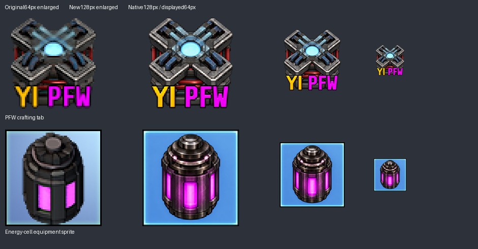

# Artwork batch 7: crafting tab and equipment cell

Version remains **0.5.1**. Two remaining static GUI assets now have 128×128 artwork: the PFW crafting-tab emblem and the filled energy cell shown in equipment grids. Inventory icons and world animation sheets remain unchanged.

## References and rendering

The crafting-tab redraw preserves the original four diagonal metal arms, cyan center, red base accents and exact **YI PFW** lettering (yellow YI, magenta PFW). The active `mpfw_ticon2.png` and unused alternate `mpfw_ticon.png` were inspected, along with both parents' crafting-group icons. No equivalent parent replacement was selected; the unused alternate remains intact. This emblem has no assigned entity or animation sheet.

The equipment image uses the accepted filled-cell master as its model reference and the original equipment sprite as its blue-panel reference. The same cap, stacked rings, ribs and glowing magenta panels remain recognizable across inventory and equipment views. The existing opaque blue backing and pale border are retained. This is a generated composition, not a pixel-identical copy of the master. The filled/empty inventory pair remains byte-identical to batch6.

Parent references remain Yuoki 1.3.0 at `50ea38b9703a13e8644c3bcfe6e400b3bf2b4a5c` and Engines 1.3.0 at `8d777d015e36d93d2757a290c3f3f32a49c11280`; the related parent battery family was already inspected during batch6. Neither parent supplies the selected PFW emblem or matching cell equipment image.

Factorio's 2.1.21 [ItemGroup documentation](https://lua-api.factorio.com/latest/prototypes/ItemGroup.html) defines the square icon size and notes 128px base-game group artwork. The [Sprite documentation](https://lua-api.factorio.com/latest/types/Sprite.html) defines source dimensions and display scale. Accordingly, the tab uses `icon_size = 128`; the equipment sprite uses `width = 128`, `height = 128`, `scale = 0.5`, preserving its former 64×64 display dimensions. Its 2×2 grid shape, capacity and flow limits do not change.

## Evidence and validation

The built-in image generator produced both masters. [The manifest](data/ai-redraw-0.5.1.json) records exact prompts, hashes, dimensions and references. Both derivatives use 128px Lanczos resampling, explicitly overriding the earlier 64px default. The tab retains transparency; the equipment panel remains fully opaque. Masters and comparison are under `docs/artwork/ai-redraw-0.5.1/`.

The existing validator permits 128px only for these two assets, reads recorded dimensions for icons, and applies a narrow expectation for this single equipment sprite. All other full-data equality checks remain in force. There are now **32 AI artwork assets (31 icons and one equipment sprite) and 85 unchanged original PNGs**, totaling 117. Previous parent replacements, arrow mappings, all 30 preceding redraws, disabled source and unused unique artwork remain intact.

Factorio 2.1.21 headless loaded the 144-file package with both pinned parents, created a fresh game and reloaded it for 600 ticks. Independent batch6 comparison confirms exactly the group icon-size change and equipment width/height/scale changes, with no other prototype differences. All 105 recipe routes and quantities, 35 disabled recipe states and 232 original archive files remain preserved. [Validation and package identity](data/artwork-batch-7-validation.txt) record the checks. Graphical confirmation in the crafting tab and equipment grid remains for the owner's local client. No version bump or migrations were added.
