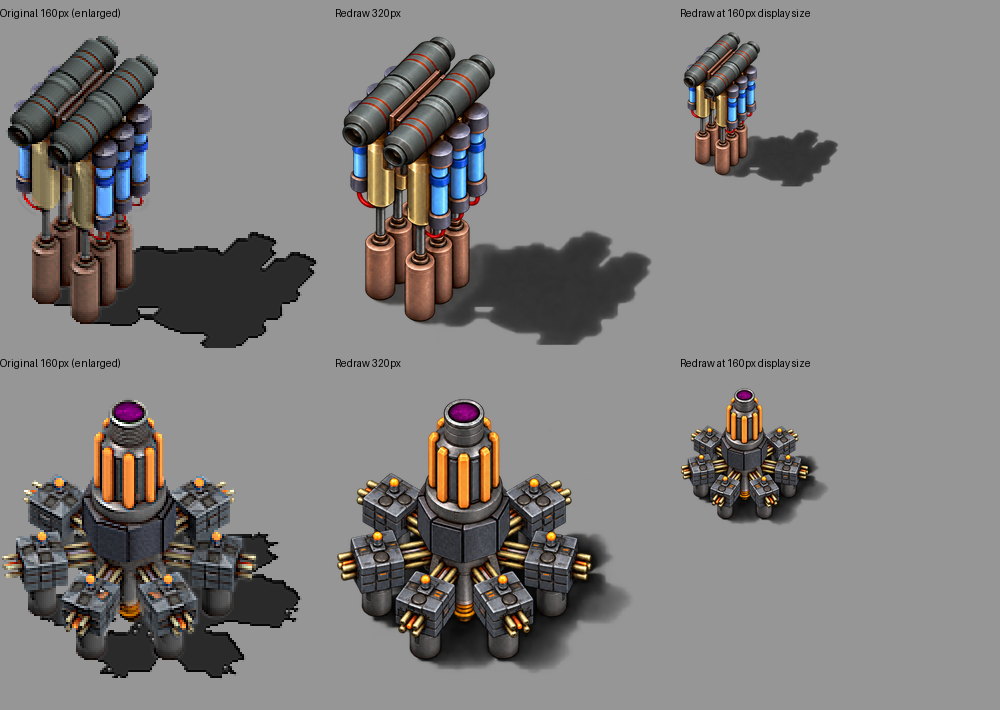

# Artwork batch 8: static profit displays

Version remains **0.5.1**. Both profit-display world sprites now use 320×320 sources at `scale = 0.5`, retaining their original 160×160 display canvas. These machines use single static frames; this batch does not redraw an animation sequence.

| World sprite | Entity | Preserved shift |
| --- | --- | --- |
| `graphics/entity/profit-show-1.png` | `y-rich-2` | `{1.0, -0.25}` |
| `graphics/entity/profit-show-2.png` | `y-rich-1` | `{0.5, -0.25}` |

The original world sprites supplied camera, placement, colors and shadow references. The accepted batch3 icon masters supplied detail: twin grey-green pipes with red bands, brass supports and blue cylinders for the first display; six box-on-cylinder stations around an orange column with a purple top for the second. The world artwork keeps the original offset composition instead of centering the machine as an inventory icon would.

Both parent revisions were rechecked: Yuoki 1.3.0 at `50ea38b9703a13e8644c3bcfe6e400b3bf2b4a5c` and Engines 1.3.0 at `8d777d015e36d93d2757a290c3f3f32a49c11280`. The earlier batch3 visual review of 242 loaded building-graphic paths remains applicable to these unchanged revisions; a refreshed profit/show/rich filename search found no candidate. No confirmed equivalent parent sprite was selected. This reuses that recorded review, rather than claiming a new complete parent-art scan.

The built-in image generator produced the masters. Initial shadows looked too pale against grey, so they received targeted corrections. The first radial correction enlarged the machine and cropped its left pipes; it was rejected. A second edit used only the initial redraw as its reference. The selected outputs retain the offset machine layouts and rightward shadows, with softer edges and changed shadow contours compared with the originals. They are generated redraws, not pixel-identical geometry or shadow masks. In-game placement and shadow appearance still need the owner's graphical check.

Selected masters, initial drafts and the rejected radial correction are retained under `docs/artwork/ai-redraw-0.5.1/`. The [manifest](data/ai-redraw-0.5.1.json) records prompts, hashes, reference identities and correction history. Only Lanczos resampling produces the 320px runtime derivatives; no manual shadow painting or alpha replacement is applied.

Following Factorio's [Sprite dimensions and scale contract](https://lua-api.factorio.com/latest/types/Sprite.html), source width/height are doubled and scale is halved. The only prototype changes are those six fields across the two machines. Shifts, collision/selection boxes, animation timing, recipes, quantities and operating statistics remain unchanged. The preservation validator permits 320px only for these exact paths and applies narrow expectations to their two sprite declarations.

Current totals are **34 AI artwork assets: 31 icons, one equipment sprite and two world sprites**, plus **83 unchanged original PNGs**, totaling 117. Earlier artwork, parent replacements, generated arrows, disabled code and unused unique assets remain intact. [Validation and package identity](data/artwork-batch-8-validation.txt) record headless loading, new-game/reload checks and full preservation comparison. No version bump or migrations are included.
