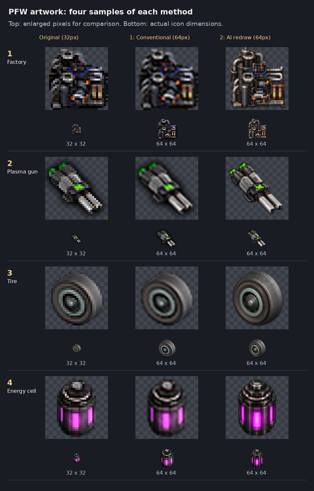

# Decision: use AI-assisted redraws for retained artwork

Status: **accepted by the owner on 2026-10-09**. Applies to retained PFW artwork during the Factorio 2.1 restoration. Confirmed parent-owned artwork continues to use the parent files.

The owner requested four samples of conventional resizing and AI redraws. After seeing the ammunition factory, plasma gun, tire and filled energy cell side by side, the owner selected AI redraws and asked that the decision be recorded.

## Chosen method

Use the original artwork as the reference for AI-assisted redraws, preserving the recognizable object, palette, orientation and industrial style. The purpose is improved visual detail and readability. A redraw may interpret shapes and details; it is not a pixel-faithful enlargement. Conventional resampling remains useful for deriving game-sized PNGs from the accepted high-resolution redraws, but it is not the selected artwork-restoration method.

Review subsequent batches against the originals at their intended game sizes. Keep transparency and record prompts, source images, output identities and prototype metadata changes. For animations, consistent frames, directions and alignment must be established before replacing a sheet. Whole-sheet AI animation pilots were rejected because stationary geometry drifted between frames.

Preserve unused unique artwork and disabled source. Reusing parent artwork remains the first choice for confirmed duplicates. Artwork changes do not resolve pending item ownership, activate disabled recipes, change gameplay or authorize migrations. Version remains **0.5.1** until the owner requests another bump.

## Current artwork progress

The owner confirmed the [second batch](../ai-artwork-batch-2.md) works. The [third batch](../artwork-batch-3.md) adds seven sprite-referenced redraws and reuses the shared-factory icon from Engines, bringing the local set to 19 AI icons and 98 unchanged originals. The owner subsequently accepted the artwork.

Before future drawing, inspect the existing sprite/animation sheets and check both Yuoki Industries and Yuoki Engines for related artwork. Reuse confirmed parent assets directly. Otherwise reference both the original icon and actual sprite frames, preserving camera, footprint, structure and colors. The owner rejected icon-only component/shared-factory drafts because their structures were inaccurate. The processor's earlier color correction also remains binding: red center, eight blue outer cells. Full batch records retain the reference and correction evidence. First-batch counts below remain historical.

The owner subsequently accepted the third batch's appearance and requested the [ammunition-factory correction](../ammunition-factory-artwork.md). Its original first-batch redraw is superseded by a sprite-referenced version; the first-batch comparison below remains historical. That correction retains 19 AI icons and 98 unchanged originals.

After PR #6 merged, the [fourth batch](../artwork-batch-4.md) adds five component redraws, bringing the count to 24 AI icons and 93 unchanged originals. These items have no assigned animation sheets; both parent mods were checked for related artwork before drawing. The owner accepted the fourth batch. The [fifth batch](../artwork-batch-5.md) adds four battlefield-support icons, bringing the total to 28 AI icons and 89 originals. It records the owner’s correction of the energy-support structure to a box with a cylinder on its side; the final corrected appearance and integrated graphical check remain pending.

## Arrow variants

The owner confirmed this candidate works, then chose [Yuoki-generated arrow overlays](trade-arrow-overlays.md). Future AI work redraws base artwork only. The following first-batch record predates that overlay pass, which removes 49 redundant variants and leaves 118 local images (four AI redraws, 114 originals).

## First batch

The four reviewed AI samples are installed as 64×64 transparent icons:

| Asset | Runtime path | Consumers |
|---|---|---|
| Ammunition factory | `graphics/entity/fabrik-ammo-icon.png` | Factory item and machine icon |
| Plasma gun | `graphics/fab2/plasma-gun.png` | Gun icon; preserved inactive item declaration |
| Tire | `graphics/fab5/reifen.png` | Tire item |
| Filled energy cell | `graphics/fab8/fusion-cell.png` | Filled-cell item |

All six source references now declare `icon_size = 64`; five are active. Recipes that inherit these item icons follow automatically. World sprites, the equipment sprite, export variants and the empty-cell icon are unchanged in this batch. Their future redraws must be reviewed for consistency with the selected designs. The four replaced original icons remain in the immutable import; all other 163 local PNGs remain byte-identical. The earlier 39 parent-artwork replacements remain intact.

The [manifest](../data/ai-redraw-0.5.1.json) records exact prompts, built-in `image_gen` provenance, original/output hashes, full-resolution source paths and dimensions. The full-resolution PNGs are under `docs/artwork/ai-redraw-0.5.1/`; runtime copies are the same 64px Lanczos derivatives shown in the comparison. Documentation and authoring images are excluded from the candidate mod ZIP.

Factorio's [2.1.21 icon documentation](https://lua-api.factorio.com/2.1.21/types/IconData.html) defines `icon_size` as the square image size in pixels. The existing [full-dump validator](../tools/validate_parent_content.py) admits only these four image replacements and their icon-size changes on top of the documented parent consolidation, while checking all other retained images and gameplay data. [Validation and candidate identity](../data/ai-redraw-0.5.1-validation.txt) record the package checks. The owner accepted the sample appearance; graphical validation of the integrated candidate remains a separate local check.

## Paired states and batch 6

The owner requires the empty energy cell to use the same physical model as the first-round filled cell. The [sixth batch](../artwork-batch-6.md) directly edits the accepted filled master to switch off its glow, and redraws the second-armor icon after inspecting its assigned parent character sheet. Current inventory: 30 AI icons and 87 originals. Existing filled artwork and animation sheets remain unchanged; graphical confirmation of batch6 is pending.

## Static GUI artwork, batch 7

The [seventh batch](../artwork-batch-7.md) adds the PFW crafting-tab icon and energy-cell equipment sprite at128px. Equipment scale0.5 preserves the64px display dimensions and existing2x2 shape. Batch7 inventory:32 AI artwork assets (31icons and one equipment sprite),85 originals. Prompts and per-entry derivative dimensions supersede the earlier64px default for these two only; owner graphical confirmation remains pending.

The [eighth batch](../artwork-batch-8.md) redraws both static profit-display world sprites at320px and scale0.5. Original world sprites govern placement and shadows; accepted icon masters supply detail. Batch8 inventory:34 AI artwork assets (31icons, one equipment sprite, two world sprites),83 originals. Per-entry320px derivatives override the earlier64px default only for these two paths. Shadow correction history is retained; graphical placement/shadow review remains pending.

Owner guidance: for assets already supplied by Yuoki or Engines, verify the match or replacement, update PFW references and remove confirmed duplicate local files. Do not add extra documentation, screenshots, comparison sheets or GIFs for routine parent-asset reuse. Keep the existing functional replacement mapping where needed by validation. Uncertain matches and unique assets stay untouched.

## Layered animation method

The owner selected a fixed AI-redrawn body with separately assembled moving parts for **all animations we redo**. Inspect the original motion and both parent mods first. Keep the body and shadow static; animate only the moving components, preserving cycle length, direction, occlusion, placement and crafting-state behavior. Factorio supports [animation layers and repeat_count](https://lua-api.factorio.com/latest/types/Animation.html); the shipped 2.1.21 assembler definitions use static base/shadow layers alongside animated parts. A [single Animation4Way animation](https://lua-api.factorio.com/latest/types/Animation4Way.html) applies to every direction when the original views are identical.

The ammunition factory is the first application: its accepted sprite-referenced AI master supplies the body and two rotors; the original sheet supplies the motion reference and shadow. Front and rear drums each carry two opposing light/cutout assemblies; both use the same projection, with a separate rear housing mask. The 16-frame cycle and world canvas remain unchanged. [Build script](../tools/build_ammo_animation.py) and the existing [manifest](../data/ai-redraw-0.5.1.json) retain reproducible authoring inputs; the original sheet remains available for future use. The owner accepted this ammunition animation on 2026-10-09; it is the reference for subsequent redraws. Temporary previews and rejected whole-sheet drafts are kept outside the repository.

For every redraw, separate flat rotating faces from housings and visible depth. Never rotate a shaded cylinder crop as though it were a flat disk: this bends its apparent axis and rotates its lighting. Project each moving cutout, its metal edge and its light together onto the fixed surface, preserving perspective and occlusion. Remove the entire cutout from the stationary base, not just the orange center. Inspect a full cycle before integrating each animation.

The owner accepted the weapons-factory animation on 2026-10-09. It applies that reference to its four green upper indicators and paired green front cutouts. Its accepted AI master supplies the static body; the original sheet supplies motion and shadow references. Keep the workbench stationary. Check bare bases for leftover lights or recesses, moving layers for clipping, paired indicators for consistent shape, and fixed hubs for wobble before reviewing the complete cycle.

The cyborg factory uses fixed vat shells and a separate liquid layer: green fill, processing through brown to pink, then draining. Preserve the original 16-frame cycle at speed0.2 and keep the wall ports visible when empty. Its liquid texture comes from the accepted AI master; colors and levels follow the original sheet. Graphical confirmation of this candidate is pending.

The vehicle factory applies the accepted rotor method to four blue upper indicators and paired front/rear cutouts. Keep its loader stationary and mask the rear indicators behind the copper housing. The owner identified an incomplete front cylinder in the initial master: correct the local drum to a full concentric face with a centered hub, and align both the moving cutouts and inventory icon with it. Preserve the original 16-frame cycle and sheet; graphical confirmation of this correction is pending.

The owner selected a shared neutral left module for weapons, vehicle, equipment and component factories. Use independent trim, ring, panel and light masks; combine these with each right-hand assembly. `docs/data/factory-palettes.json` controls colors and the optional opening-glow overlay (components initially). Run `docs/tools/build_shared_factories.py` after palette changes to synchronize runtime tints and icons. The corrected vehicle cylinder is reused. Superseded generated per-factory layers/builders are replaced; original sheets and AI masters remain. The component right module retains its original cell-production cycle pending its separate redraw. Its speed remains0.2; the other three remain1. Ammunition and cyborg factories retain their distinct arrangements. Factorio supports layered animations and [per-layer tint](https://lua-api.factorio.com/latest/types/SpriteParameters.html). Shared-module graphical confirmation is pending.
