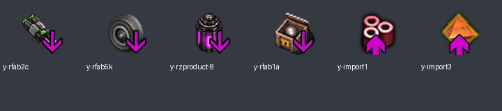

# Decision: generate trade arrows with Yuoki's library

Status: **accepted on 2026-10-09**. After confirming the first AI-icon candidate works, the owner requested replacing duplicate pink-arrow images with Yuoki's existing up/down-arrow helper.

The counts and previews below describe the arrow conversion at `da0aa93`. The [second AI batch](../ai-artwork-batch-2.md) later redraws eight retained base icons; the helper stays unchanged and that batch totals 12 AI icons plus 106 originals. The [third batch](../artwork-batch-3.md) brings the local total to 19 AI icons plus 98 originals. The [fourth batch](../artwork-batch-4.md) brings the total to 24 AI icons plus 93 originals. The [fifth batch](../artwork-batch-5.md) brings the total to 28 AI icons plus 89 originals; three export base layers follow the new icons while pink arrows remain unchanged.

## Implementation

PFW now calls `yi.lib.recipe.atomics.item_down(item_name)` for its **48 export recipes** and `item_up(item_name)` for its **eight import recipes**. Exports show the item consumed; imports show the item received. The helper reads the current item's icon and appends Yuoki's arrow layer. The plasma gun, tire and filled-cell export icons therefore inherit their accepted AI redraws automatically; future base-icon changes can follow the same path without another arrow PNG.

The [explicit mapping module](../../prototypes/trade-icons.lua) runs at the end of `data.lua`, after all PFW items, ammo and guns have been registered. Calling the helpers inside the earlier recipe declaration tables would be premature for some sources. Only the 56 listed PFW recipes are affected. Old single-icon fields are cleared; recipe ingredients, outputs, quantities, categories and other gameplay fields are unchanged.

The existing Yuoki implementation also handles layered source icons and different item types. We reuse it without changing the parent library or implementing a second compositor. Source: [pinned Yuoki helper](https://github.com/jatmn/Yuoki-Factorio-2.x/blob/50ea38b9703a13e8644c3bcfe6e400b3bf2b4a5c/lib/yi-tools.lua#L463). Factorio's [2.1.21 icon specification](https://lua-api.factorio.com/2.1.21/types/IconData.html) defines layer order and scale. The helper supplies both the base layer and the pink arrow at the appropriate scale.

## Removed variants and preserved content

**49 precomposed PNGs were removed:** 48 pink down-arrow variants and the older generic package icon with a red trade arrow. That package variant now uses the same parent-provided pink down arrow as the other exports. There were no separate baked pink up-arrow files in this inventory; the eight import recipes previously inherited unmarked item icons and now receive generated up arrows. The ammo and generator exports previously used unmarked icons and now receive down arrows.

Every removed variant has a confirmed, retained base-art mapping in the [manifest](../data/trade-icons-0.5.1.json), including unused variants. Removal is based on redundant artwork, not whether a file is currently used. The differently named `mcb_ranger--sell.png` and `mcb_ranger-sell.png` map to their distinct base characters. Files such as `mcb_pg_up_32.png` are **base art**, despite their names, and remain.

Eight disabled export declarations now contain commented helper expressions instead of baked-arrow paths, including seven previously stale paths. They remain inactive, with their original ingredients/results retained. When restoring them, register the source item first and apply the icon after registration, as the active mapping module does. The dormant movement-equipment export points to the previously confirmed parent item `yi_equip_legs_a` for its future icon source. This does not resolve any pending equipment/gun identity or activate a recipe.

The package retains **118 local PNGs: four accepted AI icons and 114 byte-identical originals**. All unique unused base artwork and all disabled code remain. The earlier 39 confirmed parent-asset replacements are still in effect. Every original file remains in the immutable import commit. Version stays **0.5.1**, with no migrations and no merge/release publication.

## Verification

The [existing validator](../tools/validate_parent_content.py) checks each removed variant's original hash, retained base image/hash/dimensions, absence of deleted paths from Lua, and the expected icon layers from current source prototypes. Its complete engine-dump comparison preserves all 105 recipes, 35 disabled recipe states and unrelated parent behavior. A separate comparison against the previous candidate found **exactly 56 recipe changes, confined to icon fields**.

[Package validation](../data/trade-icons-0.5.1-validation.txt) records successful headless loading, fresh-game creation and a 600-tick same-version save reload. The package contains the exact validated runtime files. The two [variant/base sheets](../artwork/trade-icons-0.5.1/arrow-pairs-0.png) ([second sheet](../artwork/trade-icons-0.5.1/arrow-pairs-1.png)) preserve the visual mapping review.

The preview below composites the actual dump's layers for inspection; it is not an in-game screenshot. Check the final arrows and alt-mode presentation in the graphical client.

## Ongoing artwork work

Continue AI redraws on base artwork only. Do not generate, restore or carry a separate baked-arrow version; use this helper convention for restored/new import and export recipes. Review animation consistency separately before changing any animation sheet.

The [sixth batch](../artwork-batch-6.md) brings the current total to 30 AI icons and 87 originals. One inactive second-armor arrow mapping receives its new base hash/dimensions; active arrow recipes are unchanged.
