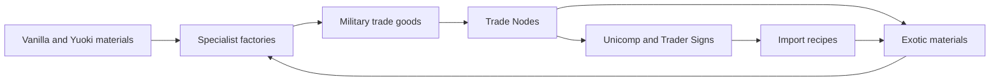

# Gameplay and economy

Profit from War is a war-themed manufacturing and trading economy. Its central challenge is connecting production lines so that exported goods pay for materials used elsewhere in the factory.

## What trading means

A Trade Node is an electric assembling machine restricted to the `yrcat-retrade` category. A sale consumes goods and produces a fixed payment. An import consumes Unicomp and Trader Signs and produces a special material. Ordinary inserters and factory logistics can automate these transactions.

The archive has no `control.lua`, customer AI, changing prices, demand simulation, interplanetary shipment tracking, or combat economy script. Factions, endangered supply routes, and planet-destroying weapons belong to the descriptions. No mechanic in this archive makes a sale change a fictional war or destroy a planet.

- `y-unicomp-a2` is Yuoki's Unicomp, used here as material-backed purchasing power.
- `ypfw_trader_sign` is a physical trading token. Most export recipes grant one per batch. Imports consume the tokens.
- `y-fame` is a different Yuoki reputation item. It appears in commented-out walker conversion recipes; it should not be conflated with Trader Signs.
- `y-richdust` is another payment material supplied by the parent mod.

The currency and Trader Sign definitions come from the dependency ecosystem. The local Trader Sign item declaration in `ir_imports.lua` is commented out.

## Factory roles

| Factory | Active construction recipe? | Role | Active power | Crafting speed |
|---|---|---|---:|---:|
| Ammunition | Yes | Pack ammunition and manufacture trade bombs | 3 MW | 1 |
| Small Arms | Yes | Manufacture weapons packages and biological Feeders | 3 MW | 1 |
| Bio Weapons | Yes | Assemble brain parasites, cyborg goods, and mechanical war machines | 3 MW | 1 |
| Truck | Yes | Manufacture wheels, frames, trailers, and vehicle goods | 3 MW | 1 |
| War Material | Yes | Assemble equipment components and battlefield power packages | 3 MW | 1 |
| Component | Yes | Training units, medical sets, scopes, and energy cells | 2 MW | 1 |
| Trade Node | Yes | Import/export conversions | 1.25 MW | 2 |
| Heavy Weapons, Tank, Supply | No | Placeholder entity/category definitions | 3 MW each | 1 |

Each of the six buildable factories costs two basic Yuoki machine frames, six blue gears, and four basic chips. The Trade Node recipe costs two basic frames, six blue gears, and one Yuoki Stargate, and produces ten nodes.

Biomass uses the `chemistry` category rather than a dedicated PFW factory. There is no technology prototype in the archive. Its recipe declarations use `enabled = "true"`; access is primarily constrained by ingredients and crafting categories, rather than a PFW research tree.

## Goods versus usable equipment

The cyborgs and trucks are ordinary inventory items. They are not deployable NPCs or drivable vehicles. Likewise, most bombs and named weapons are products for sale or ingredients for further manufacturing. Generic package icons help signal this distinction, although the old localization does not always make it clear.

Three actual guns, electrical ammunition, two armor items, and seven equipment prototypes also exist. Their crafting paths are incomplete in this release; see [incomplete content](incomplete-content.md). The walkers are worn armor with custom character animations, not vehicles or independent robots.

## Wealth machinery

Two extra assembling machines use the parent mod's `yuoki-fame-recipe` category:

- `y-rich-1`, Nagshell Theocrafting Center: speed 6, 10 MW.
- `y-rich-2`, Be Rich and Show this: speed 18, 25 MW.

Their construction recipes are commented out. Their descriptions and the historical mention of effectively endless energy should not be treated as a complete, reachable standalone PFW power progression. The corresponding parent-mod recipes and access paths need separate investigation.

Primary source files: [factories](../prototypes/e_factory.lua), [Trade Node and wealth machinery](../prototypes/e_basic.lua), [construction recipes](../prototypes/ir_factory.lua), [Trade Node recipe](../prototypes/ir_basic.lua), [entry point](../data.lua), [English descriptions](../locale/en/item-names.cfg).
